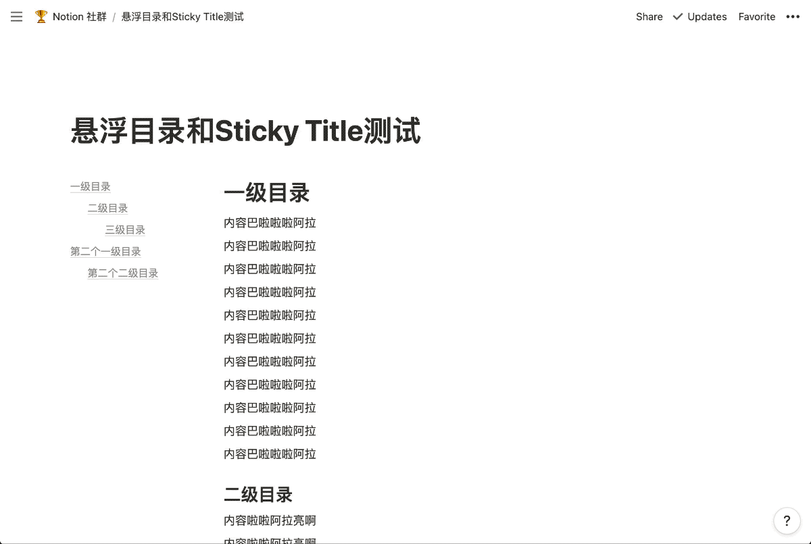
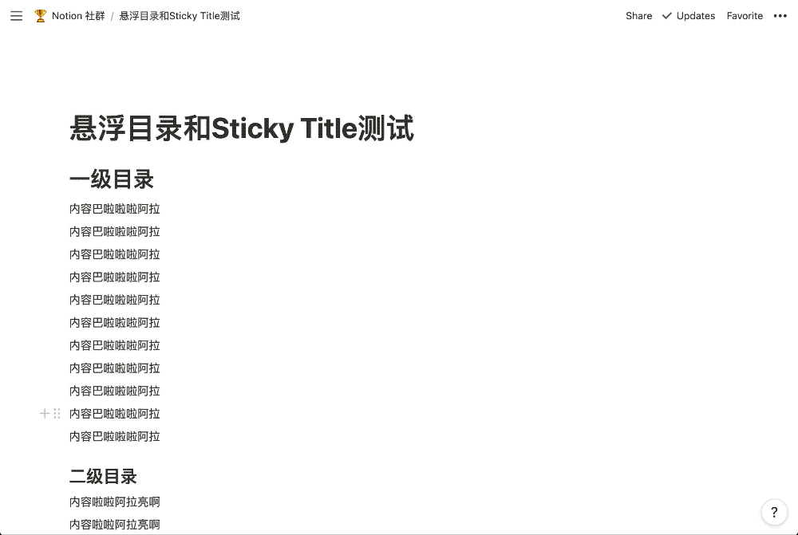

tampermokey-scripts
----

# notion 悬浮目录插件：notion-toc-floating.js

## 下载

[Notion TOC Floating | 悬浮目录 | 悬浮Heading](https://greasyfork.org/zh-CN/scripts/427001-notion-toc-floating)

## 功能

- 悬浮目录。只取第一个`table_of_contents`。
- 悬浮标题（一级、二级、三级）。

> 为了提升体验，默认以下场景会禁用悬浮标题效果
> - 内容包含`table_of_contents`时;
> - 内容包含分列时；

## 效果预览

悬浮目录

悬浮标题

